# Full System Architecture

Rizzume - local-first, browser-based document editor with ATS-aware PDF export.

**Quick reference:** [../ARCHITECTURE.md](../ARCHITECTURE.md) · **Engine decision:** [../ENGINE_DECISION.md](../ENGINE_DECISION.md) · **Specs:** [../.kiro/README.md](../.kiro/README.md)

---

## Table of contents

1. [Part 1 - General](#part-1--general)
2. [Part 2 - Detailed](#part-2--detailed)
3. [Part 3 - Technical](#part-3--technical)

---

# Part 1 - General

## 1.1 Purpose

Rizzume is a **single-page application** that lets users create structured resumes and CVs without an account. Users edit content in a form-based editor, see a **live PDF preview**, run **ATS and regional lint checks**, and **export a text-selectable PDF** suitable for job portals (JobStreet, Maukerja, email applications).

Primary audiences:

- **Malaysia corporate** applicants - ATS-strict template, A4, navy accent, British English hints
- **International** applicants - classic template, US Letter, standard export profile

## 1.2 System constraints

| Constraint | Implication |
|------------|-------------|
| No backend | All state in browser; no sync across devices |
| Client-side only | PDF generation via `@react-pdf/renderer`; no server render farm |
| Privacy-first | Drafts and catalog customizations stay in `localStorage` |
| ATS-safe output | Single-column layouts, standard fonts, text-based PDF |
| Static deploy | `vite build` → `dist/` served by any static host |

## 1.3 Deployment model

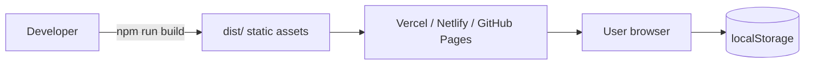

| Layer | Technology |
|-------|------------|
| UI framework | React 19 + TypeScript |
| Build | Vite 8 |
| Styling | Tailwind CSS v4 (editor chrome) |
| State | Zustand |
| Validation | Zod (schema) + custom lint modules |
| PDF generation | `@react-pdf/renderer` |
| PDF preview | Browser native PDF viewer via iframe blob URL |
| Tests | Vitest + Testing Library |

## 1.4 Architectural style

**Modular monolith** - one deployable SPA with strict module boundaries. No microservices, no shared database. Modules communicate through typed interfaces and Zustand stores, not through a network layer.

## 1.5 Core principle

> **Document → Layout (IR + plan) → RenderBackend → Blob**

Preview and layout debug are **thin shells on top of the PDF output**. They do not lay out content independently.

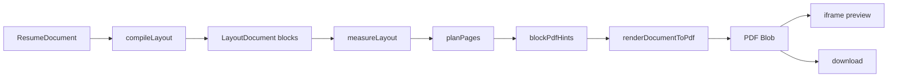

## 1.6 System context

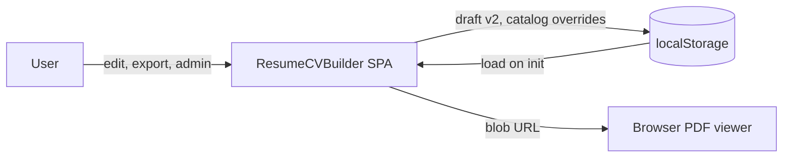

External systems:

| Entity | Role |
|--------|------|
| **User** | Edits resume, runs ATS check, exports PDF, manages catalog vocabulary |
| **localStorage** | Persists resume draft (`resume-cv-builder-draft-v2`) and catalog overrides (`resume-cv-builder-catalog-v1`) |
| **Browser PDF engine** | Renders the same blob used for preview and export (WYSIWYG) |

There is no API server, authentication provider, or cloud storage in the current architecture.

---

# Part 2 - Detailed

## 2.1 Bounded contexts

| Module | Path | Responsibility |
|--------|------|----------------|
| **core** | `packages/core/src/` | `ResumeDocument` schema (v1/v2), Zod parsing, Zustand document store |
| **presets** | `packages/presets/src/` | Regional defaults - template, theme, page size, validators, section labels |
| **themes** | `packages/themes/src/` | Visual tokens - colors, typography scale, layout profile, font stacks |
| **templates** | `packages/templates/src/` | Thin PDF entrypoints; layout profile overrides per template |
| **layout** | `packages/layout/src/` | Compile IR, DOM measure, page plan, PDF hints - **no UI chrome, no final PDF** |
| **render** | `packages/render/src/` | Shared block components (`LayoutBlockHtml`, `LayoutBlockPdf`) + `RenderBackend` contract |
| **renderers** | `src/renderers/` | PDF generation orchestration, style resolution, PDF.js helpers, download |
| **validators** | `packages/validators/src/` | ATS, typography, spacing, layout, pagination, regional lint |
| **catalog** | `packages/catalog/src/` | Bundled vocabulary, search, schema (edited in code, no admin) |
| **app** | `src/app/`, `src/components/`, `src/hooks/` | Shell, editor, preview, toolbar, routing |
| **personal** | personal/ (private) | Dale's profile pack - dev-only alias, never shipped |

## 2.2 Preset, theme, and template

Three layers configure how a document looks and validates. They are stored independently on `document.meta` after the user picks a preset.

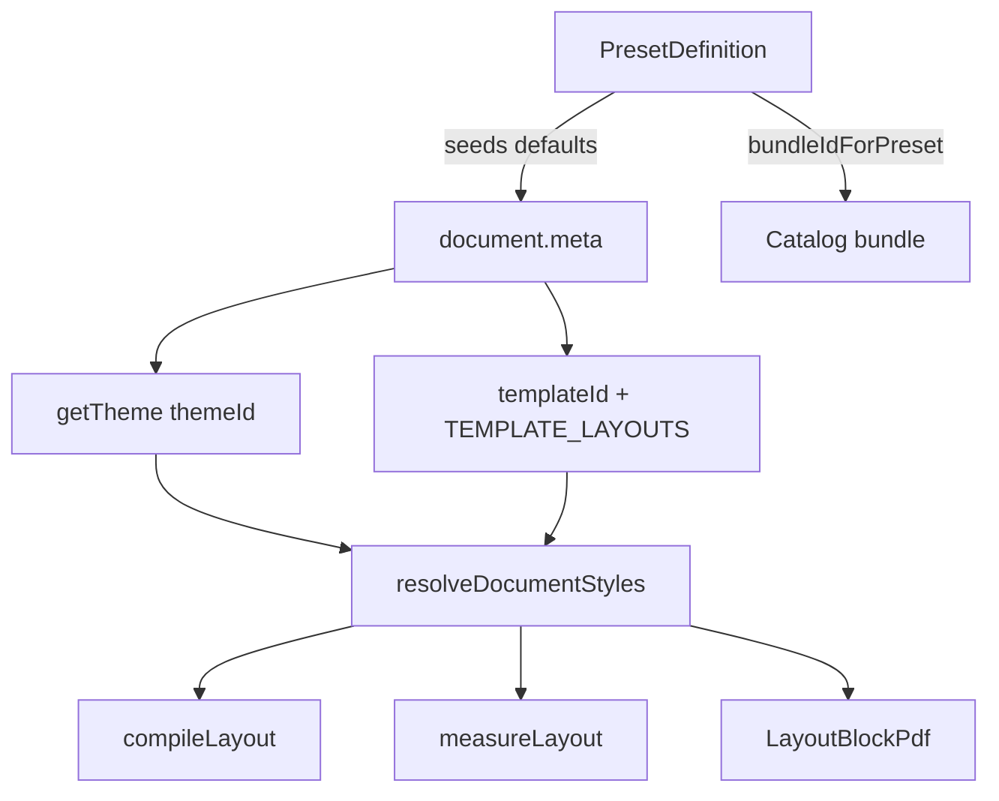

| Layer | Owns | Example |
|-------|------|---------|
| **Preset** | Regional profile, default template/theme/page size, validators, section labels, catalog bundle | `malaysia-corporate` → ATS Strict + navy-corporate + A4 + portal-safe |
| **Theme** | Colors, typography sizes, layout profile gaps, font stacks | `navy-corporate` → Carlito, `#1F3864` accent |
| **Template** | Structural layout overrides merged onto theme at render time | `ats-strict` → tighter margins, uppercase section titles |

`themeForDocument()` auto-corrects theme when document type or template changes (e.g. academic CV → `academic-serif`).

## 2.3 Module dependencies

```mermaid
flowchart TB
  app[src/app + components]
  core[@rb/core]
  catalog[@rb/catalog]
  layout[@rb/layout]
  render[@rb/render]
  renderers[src/renderers]
  templates[@rb/templates]
  themes[@rb/themes]
  presets[@rb/presets]
  validators[@rb/validators]

  app --> core
  app --> catalog
  app --> layout
  app --> renderers
  core --> presets
  core --> themes
  layout --> render
  layout --> renderers
  renderers --> templates
  renderers --> themes
  templates --> render
  validators --> layout
  validators --> themes
  catalog --> presets
```

## 2.4 Data flow diagram - Level 0

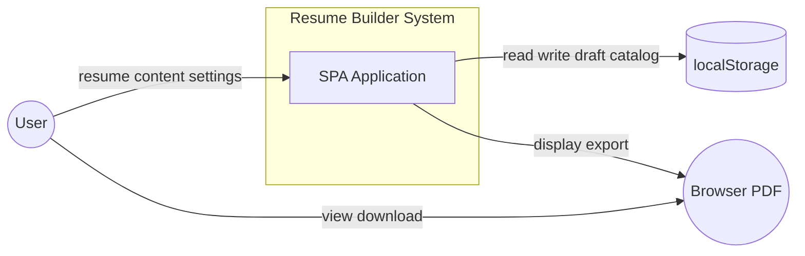

## 2.5 Data flow diagram - Level 1

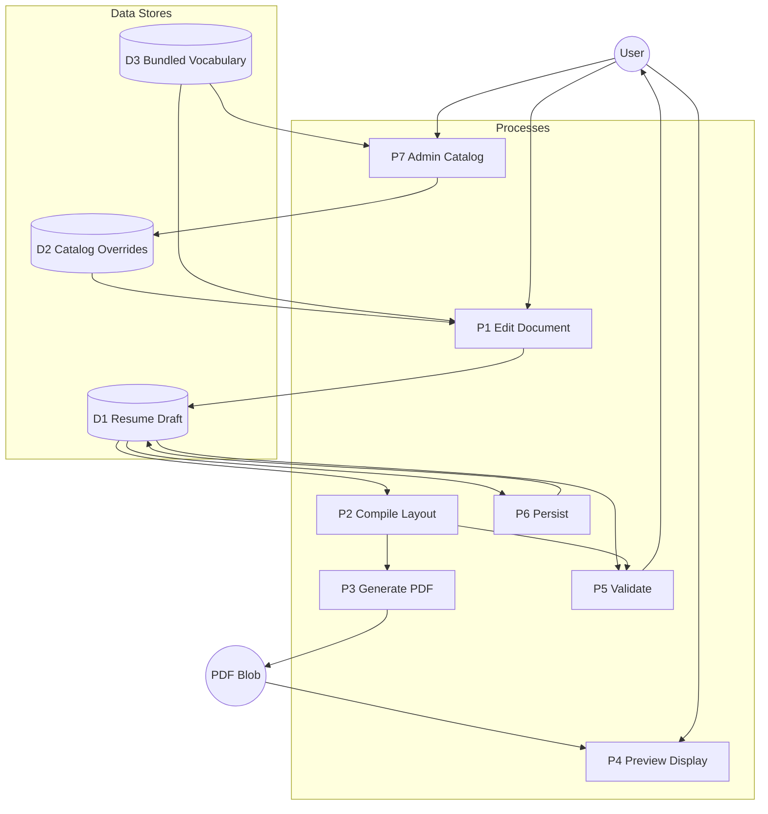

| Process | Key code | Input → Output |
|---------|----------|----------------|
| P1 Edit | `EditorPanel`, form components | User input → `documentStore` |
| P2 Compile | `computeLayoutPlan()` | `ResumeDocument` → `LayoutPlanResult` |
| P3 Generate | `generatePdfWithPlan()` | Document + plan → `Blob` |
| P4 Preview | `PdfJsPreview`, `usePdfPreview` | Blob → iframe |
| P5 Validate | `runValidation()` | Document + layout plan → `LintIssue[]` |
| P6 Persist | `usePersistence`, `catalogStore` | State → localStorage |
| P7 Admin | `CatalogAdminPage` | CRUD on catalog overrides |

## 2.6 Entity-relationship - document model

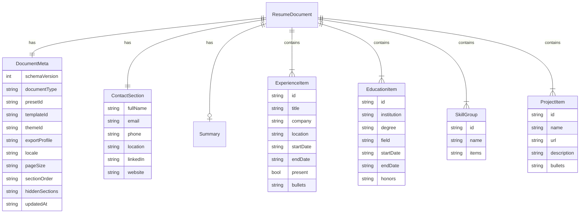

Schema versions: v1 drafts are migrated to v2 on load (`migrateV1ToV2`). v2 adds `presetId`, `themeId`, `exportProfile`, and `locale`.

## 2.7 Entity-relationship - catalog model

Catalog entries are **suggestions**. The resume document stores plain label strings, not catalog IDs.

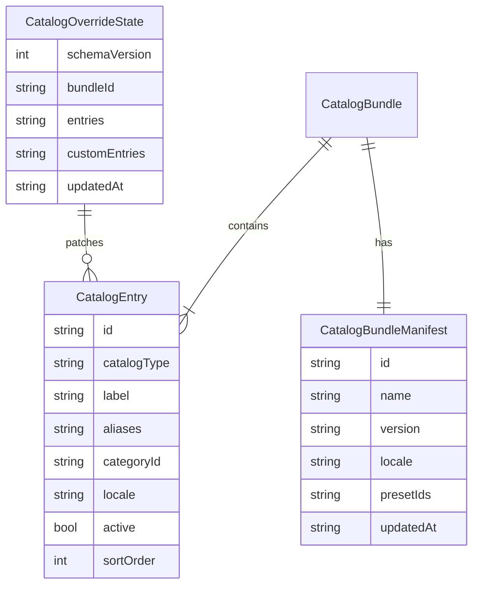

Catalog types: `skill`, `skill-category`, `language`, `language-proficiency`, `occupation`, `industry`, `institution`, `degree-type`, `location`, `certification`, `action-verb`.

Bundles: `malaysia-default` (preset `malaysia-corporate`), `international-default` (all other presets).

## 2.8 Application routing and onboarding

Hash-based routing - no React Router.

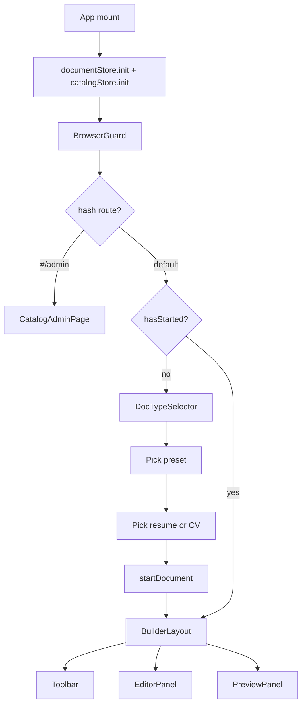

| Route | Hash | Screen |
|-------|------|--------|
| Builder | `""` or `#/` | Editor + preview |
| Admin | `#/admin` | Catalog vocabulary CRUD |

## 2.9 UI component hierarchy

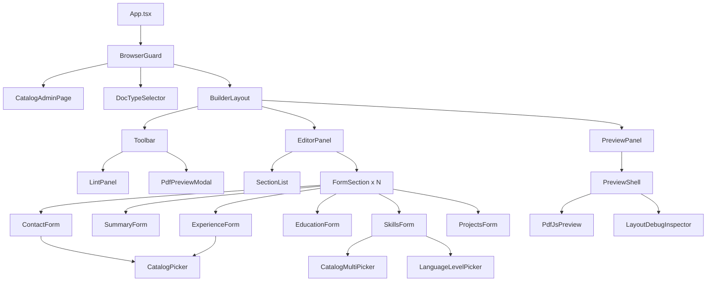

Forms write strings into `documentStore`. Catalog pickers resolve labels via `catalogStore.resolveLabel()` but never store catalog IDs on the document.

---

# Part 3 - Technical

## 3.1 Layout intermediate representation

Every piece of rendered content becomes a **`LayoutBlock`** in `packages/layout/src/types.ts`:

| Field | Purpose |
|-------|---------|
| `id` | Stable key for measure, plan, and PDF hints |
| `type` | `header`, `sectionTitle`, `paragraph`, `bullet`, `skillGroup`, `experienceItem`, … |
| `breakPolicy` | `auto` \| `keep` \| `keepWithNext` - pagination behavior |
| `spacingBeforePt` / `spacingAfterPt` | Vertical rhythm owned by IR, not CSS margins |
| `content` | Typed discriminated union (`kind: 'header'`, `kind: 'bullet'`, …) |

`LayoutDocument` adds `contentWidthPt`, `contentHeightPt`, and `templateId`.

After measurement, each block gains a **`bbox`** (`{ x, y, width, height }` in pt). `PagePlan` assigns blocks to virtual pages with orphan-title avoidance and keep-together rules.

## 3.2 Layout pipeline

Orchestrator: `computeLayoutPlan()` in `packages/layout/src/computeLayoutPlan.ts`.

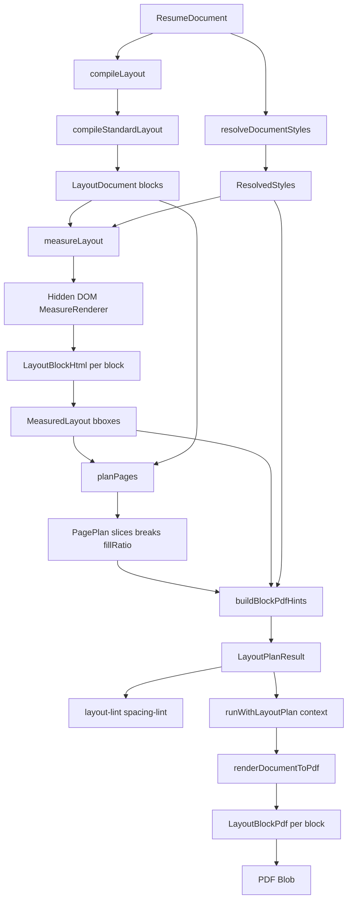

### Stage details

| Stage | File | Notes |
|-------|------|-------|
| Compile | `packages/layout/src/compile/compileStandardLayout.ts` | Walks `getVisibleSections()`; emits header + section blocks with spacing from `LayoutProfile` |
| Measure | `packages/layout/src/measure/measureLayout.ts` | Off-screen DOM; reads `getBoundingClientRect()`; SSR fallback uses line-count heuristic |
| Plan | `packages/layout/src/plan/planPages.ts` | Virtual pagination; orphan section titles; `keep` / `keepWithNext` breaks |
| Adapt | `packages/layout/src/adapt/reactPdfPlan.ts` | Maps plan → `BlockPdfHints` (`wrap`, `breakBefore`, `minPresenceAhead`) |
| Render | `packages/templates/src/shared/BlockLayoutPdf.tsx` | Single react-pdf `<Page wrap>`; all blocks via `LayoutBlockPdf` |

### Spacing ownership

| Layer | Role |
|-------|------|
| `LayoutProfile` (theme) | Semantic intent - `nameToMetaPt`, `ruleToFirstSectionPt`, bullet gaps |
| `compileLayout` | Assigns per-block `spacingBeforePt` / `spacingAfterPt` |
| `blockSpacing.ts` | Applies spacing once in HTML and PDF wrappers |
| `resolveDocumentStyles` | Typography + colors; **section titles have `marginTop: 0`** |
| react-pdf hints | Pagination only - not spacing |

## 3.3 Preview and export sequence

Preview and export share the **same PDF generation path** (`generatePdfWithPlan`). The legacy HTML `*Preview` stack was removed (see [legacy-preview-removal spec](../.kiro/specs/legacy-preview-removal/requirements.md)).

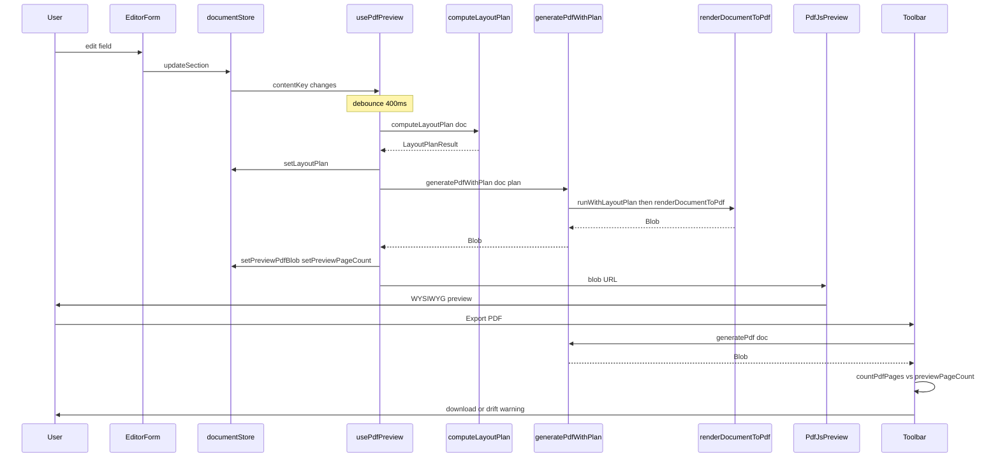

| Concern | Implementation |
|---------|----------------|
| Preview fidelity | Same blob for iframe and export |
| Page drift | `paginateDriftIssue()` warns if export pages differ from preview by more than 1 |
| Layout debug | `LayoutDebugInspector` reads `LayoutPlanResult` - schematic only, not pixel-synced to iframe |
| Debounce | `usePdfPreview` 400ms; `useLayoutPlan` 300ms |

## 3.4 RenderBackend contract

Defined in `packages/render/src/types.ts`:

```typescript
interface RenderInput {
  layout: LayoutDocument
  plan: PagePlan
  styles: ResolvedStyles
  pageSize: 'A4' | 'LETTER'
}

interface RenderBackend {
  readonly id: string
  render(input: RenderInput): Promise<Blob>
}
```

**Production path** does not call `reactPdfBackend` directly. It flows through template PDF components → `BlockLayoutPdf`, which reads the active layout plan from `runWithLayoutPlan()` context.

| Backend | Status | Path |
|---------|--------|------|
| react-pdf + block walker | **v1 (shipped)** | `renderDocumentToPdf` → `BlockLayoutPdf` |
| `reactPdfBackend` | Pluggable adapter | `packages/render/src/reactPdfBackend.tsx` |
| Forme | v2 candidate | Not implemented - see [ENGINE_DECISION.md](../ENGINE_DECISION.md) |

### Font registration

`navy-corporate` theme embeds **Carlito** (Calibri metric substitute) via `packages/render/src/fonts/registerPdfFonts.ts`, called before `pdf()` in `renderDocumentToPdf.tsx`. Preview CSS uses `@fontsource/carlito`.

## 3.5 State management and persistence

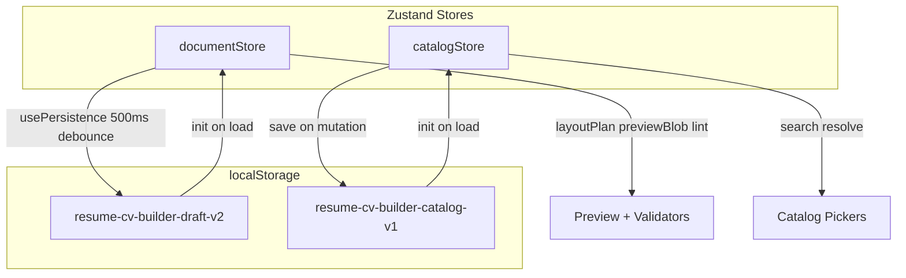

### documentStore (key fields)

| Field | Purpose |
|-------|---------|
| `document` | Current `ResumeDocument` |
| `layoutPlan` | Latest `LayoutPlanResult` from pipeline |
| `previewPdfBlob` / `previewPageCount` | Cached preview for toolbar export |
| `lintIssues` | Results from ATS check |
| `layoutDebug` | Toggle layout inspector |

### catalogStore (key actions)

| Action | Purpose |
|--------|---------|
| `init` / `syncBundleForPreset` | Load overrides; switch bundle when preset changes |
| `getEntries` / `search` / `resolveLabel` | Picker vocabulary |
| `upsertEntry` / `deleteEntry` / `importPack` | Admin CRUD + import/export |

## 3.6 Validation pipeline

Orchestrator: `runValidation()` in `packages/validators/src/ats-lint.ts`.

| Module | File | Examples |
|--------|------|----------|
| Export schema | Zod + inline | `CONTACT_NAME_REQUIRED`, `CONTACT_EMAIL_REQUIRED` |
| Typography | `typography-lint.ts` | `TYPE_SIZE_TOO_SMALL`, `TYPE_LOW_CONTRAST` |
| Spacing | `spacing-lint.ts` | `SPACE_MARGIN_TIGHT`, `PAGE_1_DEAD_ZONE` |
| Layout | `layout-lint.ts` | `LAYOUT_ORPHAN_TITLE`, `LAYOUT_PAGE_1_DEAD_ZONE` |
| Pagination | `paginate-lint.ts` | `PAGINATION_OVERFLOW_RISK`, `PAGINATION_PAGE_COUNT_DRIFT` |
| Regional | `regional/malaysia.ts` | `IC_NUMBER_DETECTED`, `LOCATION_EMPTY` |
| Catalog | `catalog/lint/catalog-lint.ts` | Vocabulary consistency |

Layout and spacing validators read `documentStore.layoutPlan`, so the compile → measure → plan pipeline must have run (via `usePdfPreview` or `useLayoutPlan`) before those rules produce results.

Preset `validators` array filters which regional rules run (e.g. `malaysia-regional` only on Malaysia preset).

## 3.7 Tech stack summary

| Concern | Package / module |
|---------|------------------|
| UI | React 19, Tailwind v4 |
| Forms | react-hook-form, `@hookform/resolvers` |
| Drag-and-drop | `@dnd-kit` |
| State | Zustand |
| Schema | Zod v4 |
| PDF write | `@react-pdf/renderer` |
| PDF read | `pdfjs-dist` (debug layout only) |
| Fonts | `@fontsource/carlito`, bundled woff for PDF |
| Test | Vitest, Testing Library, jsdom |

## 3.8 Anti-patterns

Avoid these - they caused spacing and parity bugs in earlier iterations:

1. **Parallel render trees** - duplicate HTML preview JSX alongside measure renderer + PDF blocks (legacy HTML preview removed 2026-06-11)
2. **Double spacing** - margins on both IR blocks and section title CSS
3. **SVG overlay on browser PDF plugin** - opaque canvas; cannot align with blob
4. **DOM measure as PDF proof** - Yoga layout ≠ CSS; use plan vs `countPdfPages` for parity

## 3.9 File map

```
src/
├── app/                    # App shell, routing, layout
├── core/
│   ├── types/document.ts   # ResumeDocument, sections, meta
│   ├── schema/             # Zod v1/v2, migrate, safeParse
│   └── store/              # documentStore (Zustand)
├── presets/                # malaysia-corporate, international-generic
├── themes/                 # mono, navy-corporate, academic-serif
├── templates/
│   ├── classic/            # ClassicPdf.tsx
│   ├── academic/           # AcademicPdf.tsx
│   ├── ats-strict/         # AtsStrictPdf.tsx
│   └── shared/             # BlockLayoutPdf, layoutProfiles, blockHints
├── layout/
│   ├── compile/            # compileStandardLayout, skillLines
│   ├── measure/            # measureLayout, MeasureRenderer
│   ├── plan/               # planPages
│   ├── adapt/              # buildBlockPdfHints
│   ├── debug/              # inspector, schematic, overlay
│   └── computeLayoutPlan.ts
├── render/
│   ├── types.ts            # RenderBackend contract
│   ├── reactPdfBackend.tsx
│   ├── blocks/             # LayoutBlockHtml, LayoutBlockPdf, blockSpacing
│   └── fonts/              # registerPdfFonts, Carlito
├── renderers/
│   ├── pdf/                # generatePdf, renderDocumentToPdf, download
│   └── shared/             # resolveDocumentStyles, pageSpec, contrast
├── validators/             # ats-lint orchestrator + modules
├── catalog/                # registry, bundles, store, admin, pickers data
├── components/             # editor, preview, toolbar, catalog UI
└── hooks/                  # usePdfPreview, useLayoutPlan, usePersistence, useAppRoute
```

## 3.10 Extension points

| Extension | Approach | Status |
|-----------|----------|--------|
| New render backend | Implement `RenderBackend`; swap in generate path | Forme candidate |
| DOCX export | New `renderers/docx/` from same `ResolvedStyles` + document | Future spec |
| JSON Resume import | `adapters/jsonResume.ts` | Future spec |
| Content coach | `coaches/` module - STAR, verb picker | Future spec |
| Regional presets v2 | New preset definitions + bundles | Future spec |
| New template | Add `TEMPLATE_LAYOUTS` entry + thin `*Pdf.tsx` delegating to `BlockLayoutPdf` | Supported today |
| New theme | `createTheme()` + registry entry | Supported today |

## 3.11 Related documents

| Document | Contents |
|----------|----------|
| [ARCHITECTURE.md](../ARCHITECTURE.md) | One-page pipeline cheat sheet |
| [ENGINE_DECISION.md](../ENGINE_DECISION.md) | Why v1 stays on react-pdf + measure/plan |
| [.kiro/README.md](../.kiro/README.md) | Feature specs and research index |
| [.kiro/specs/layout-engine/](../.kiro/specs/layout-engine/) | Layout engine requirements and design |
| [.kiro/specs/legacy-preview-removal/](../.kiro/specs/legacy-preview-removal/) | HTML preview stack removal |
| [packages/catalog/src/README.md](../packages/catalog/src/README.md) | Catalog module notes |

---

*Last updated: 2026-06-11 - reflects as-built codebase (schema v2, layout engine v1, Carlito PDF fonts).*
